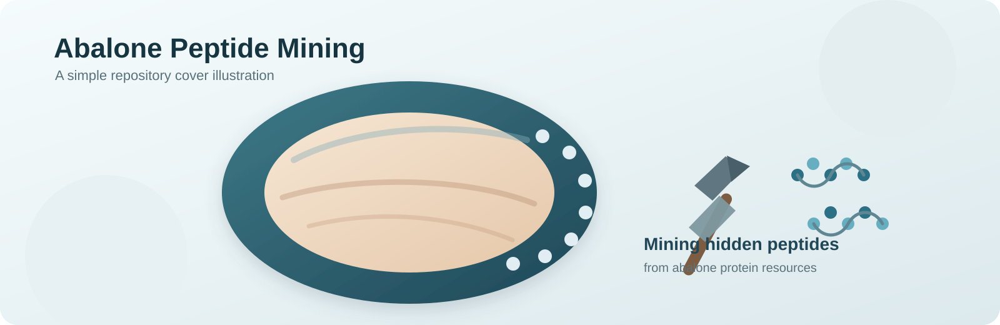

# Abalone Barrier Peptide Source Data

This repository contains the source data, scripts, and figure assets used for the script-traceable parts of the abalone barrier peptide study.

It is organized as a compact companion repository for manuscript figures rather than a full project history. The current release covers **Figure 1** and **Figure 2**, which are the figures supported by the retained local analysis scripts.

## Repository scope

Included in this repository:
- panel-level source data files for Figure 1 and Figure 2
- analysis scripts used to generate or support those figures
- generated intermediate figure assets used for figure assembly
- final submitted `Fig1.jpg` and `Fig2.jpg`
- a panel-to-data mapping table for auditability

Not included:
- unrelated exploratory analyses
- manuscript drafting files
- figures without retained script provenance in this export

## Repository layout

```text
.
├── data/
│   ├── Fig1/
│   └── Fig2/
├── docs/
│   └── PANEL_DATA_MAPPING.csv
├── figures/
│   ├── final_submission/
│   └── generated_sources/
└── scripts/
    ├── fig1_peptide_screening/
    └── fig2_transcriptomics/
```

## Contents by folder

### `data/`
Minimal source data required to reproduce the retained figure panels.

- `data/Fig1/`
  Inputs and panel-level exports for peptide screening and physicochemical summaries.
- `data/Fig2/`
  Raw count matrix, annotation table, sample metadata, and panel-level exports for transcriptomic analysis.

Each panel subfolder contains a small source-data table plus a `README.txt` describing the panel-specific content.

### `scripts/`
Scripts used for the figures included in this repository.

- `scripts/fig1_peptide_screening/`
  Peptide digestion, filtering, selection, deduplication, and plotting steps for Figure 1.
- `scripts/fig2_transcriptomics/`
  Differential expression, enrichment analysis, and publication-style plotting steps for Figure 2.

### `figures/`
- `figures/final_submission/`
  Final submitted composite figures: `Fig1.jpg` and `Fig2.jpg`.
- `figures/generated_sources/`
  Generated figure components and publication-style exports produced during analysis.

### `docs/`
- `docs/PANEL_DATA_MAPPING.csv`
  Figure-panel mapping table linking each panel to its retained source table and output file.

## Figure coverage

### Figure 1
Figure 1 is supported by the peptide-screening workflow in `scripts/fig1_peptide_screening/` and by the processed source files under `data/Fig1/`.

Key retained inputs:
- `data/Fig1/protein.faa`
- `data/Fig1/step4b_final_dedup.csv`
- `data/Fig1/panels/A` to `data/Fig1/panels/F`

### Figure 2
Figure 2 is supported by the transcriptomics workflow in `scripts/fig2_transcriptomics/` and by the retained data under `data/Fig2/`.

Key retained inputs:
- `data/Fig2/GSE116936_raw_counts_GRCh38.p13_NCBI.tsv`
- `data/Fig2/Human.GRCh38.p13.annot.tsv`
- `data/Fig2/sample_info.csv`
- `data/Fig2/panels/A` to `data/Fig2/panels/E`

For panel B, the exact heatmap matrix is regenerated from the raw count matrix and sample metadata by `scripts/fig2_transcriptomics/01_DESeq2_Control_vs_TNF.R`.

## Reproducibility notes

This repository is intended to preserve the source data and retained scripts required to trace the included figures.

Reproducing the analyses may require:
- an R environment for the transcriptomics scripts
- the R packages expected by the DESeq2 and enrichment-analysis workflow
- a Python environment for the peptide-screening scripts

Environment lockfiles are not included in this export, so this repository should be treated as a source-data and script companion rather than a fully containerized reproduction package.

## Panel mapping

For figure-to-source traceability, see:
- `docs/PANEL_DATA_MAPPING.csv`

## Citation

If you use material from this repository, cite the associated manuscript and reference this GitHub repository as the source-data companion archive.
